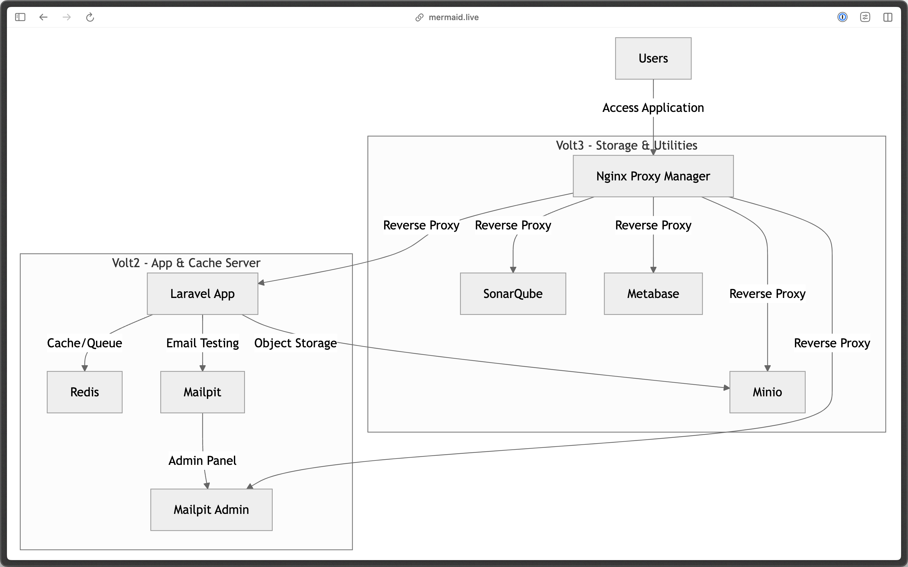
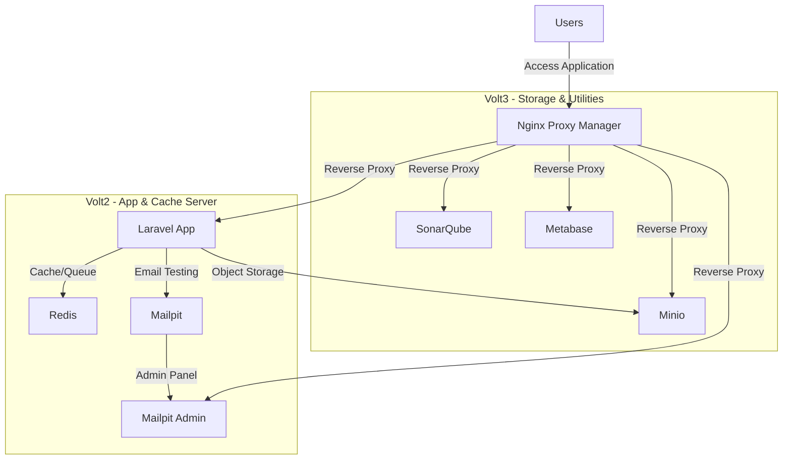

# My Awesome Laravolt Application

## Server Requirements

1. PHP 8.4
1. Composer 2
1. SQLite, PostgreSQL or MariaDB

## Local Setup

1. Clone repository
1. Jalankan `composer install`
1. Salin `.env.example` ke `.env`
1. Sesuaikan konfigurasi database dan lain-lain
1. Jalankan `php artisan key:generate`
1. Jalankan `php artisan migrate:fresh --seed`
1. Jalankan `php artisan storage:link`
1. (Optional) Jalankan `php artisan vendor:publish --tag=laravolt-assets`
1. Pastikan folder-folder berikut _writeable_:
   1. bootstrap/cache
   1. storage
1. Jalankan `php artisan serve` atau `composer dev`

## Development Setup

